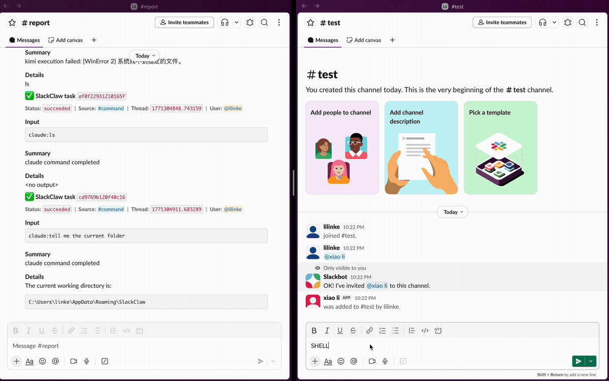
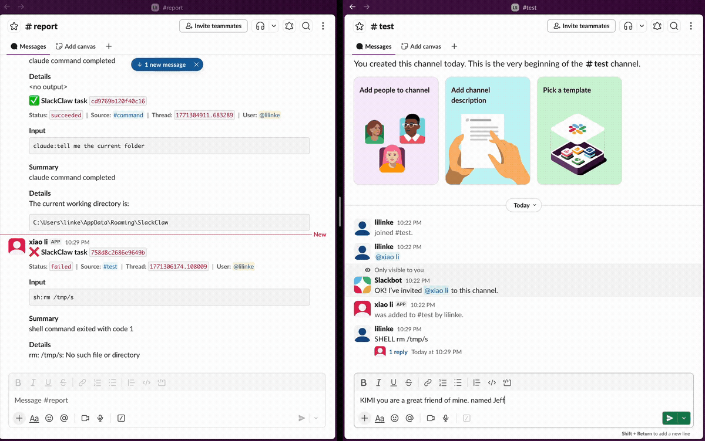

# SlackClaw

[](https://www.python.org/)
[](LICENSE)

[English](README.md) | [中文](README.zh-CN.md)

Type commands in Slack, run them locally, check reports in Slack.

SlackClaw is a local agent that watches a Slack channel for commands, executes them on your machine, and posts structured reports back to Slack. It supports shell commands and AI agent CLIs (Claude, Codex, Kimi) out of the box.

## Use Prebuilt Binary (Recommended)

Do not build from source for normal use. Use the packaged binary from GitHub Releases and run it directly.

- Download the latest binary for your OS from: `https://github.com/linkeLi0421/slackclaw/releases`
- Put it under `release/` (or any local path you prefer)
- Run setup once, then start the app

macOS:
```bash
chmod +x ./release/SlackClaw-macos-arm64
./release/SlackClaw-macos-arm64 --setup
./release/SlackClaw-macos-arm64
```

Linux:
```bash
chmod +x ./release/SlackClaw-linux-x64
./release/SlackClaw-linux-x64 --setup
./release/SlackClaw-linux-x64
```

Windows (PowerShell):
```powershell
.\release\SlackClaw-windows-x64.exe --setup
.\release\SlackClaw-windows-x64.exe
```

## How It Works

```
Slack command channel          Your machine             Slack report channel
┌─────────────────┐     ┌──────────────────────┐     ┌─────────────────────┐
│ SHELL ls -la    │ ──▶│ SlackClaw picks up   │ ──▶│ Formatted report    │
│ CLAUDE fix tests│     │ the message, runs it │     │ with status, output │
│ CODEX refactor  │     │ locally, then posts  │     │ and details         │
│ KIMI explain    │     │ the result to Slack  │     │                     │
└─────────────────┘     └──────────────────────┘     └─────────────────────┘
```

## Demo

### 1. Approval Mode for Dangerous Commands



Demonstrates the approval workflow for shell commands. When a potentially dangerous command (like `rm`) is detected, SlackClaw waits for emoji approval (:white_check_mark: or :x:) before execution. Safe commands run automatically based on the allowlist.

*Duration: 10 seconds | Shows: Command input, approval flow, success/failure reports*

---

### 2. Thread Context Sharing



Shows how AI agents (Claude, Codex, Kimi) maintain context within the same Slack thread. Replies in a thread share conversation history, allowing for follow-up questions and iterative workflows.

*Duration: 15 seconds | Shows: Thread replies, context retention, agent responses*

---

### 3. General Task Execution


A general-purpose task showing Kimi CLI integration. Ask questions, get summaries, or request code improvements — all from Slack and executed locally.

*Duration: 8 seconds | Shows: AI agent interaction, detailed responses, project assistance*

---

**Summary:** Type commands in Slack → Run locally → Get structured reports back in Slack.

1. You type a command in the Slack **command channel**
2. SlackClaw detects it, optionally waits for emoji approval
3. The command runs locally on your machine
4. A formatted report appears in the Slack **report channel**

## Quick Start

### 1. Create the Slack App

Go to [api.slack.com/apps](https://api.slack.com/apps) and create a new app:

- **Socket Mode** — enable it, then create an app-level token with `connections:write` scope
- **Event Subscriptions** — enable and subscribe to bot events: `message.channels`, `message.groups`, `reaction_added`
- **OAuth Bot Scopes** — add: `chat:write`, `channels:history`, `groups:history`, `files:read`
- **Install** the app to your workspace
- **Invite** the bot to your command and report channels: `/invite @your-bot`

See [slack-app-setup.md](slack-app-setup.md) for a detailed step-by-step walkthrough.

### 2. Run the Packaged App (No Source Build)

macOS:
```bash
./release/SlackClaw-macos-arm64 --setup
./release/SlackClaw-macos-arm64
```

Linux:
```bash
./release/SlackClaw-linux-x64 --setup
./release/SlackClaw-linux-x64
```

Windows (PowerShell):
```powershell
.\release\SlackClaw-windows-x64.exe --setup
.\release\SlackClaw-windows-x64.exe
```

On first run, SlackClaw opens a local setup page in your browser. Save Slack tokens/channel IDs there, then the app starts.

## Typing Commands in Slack

Send messages in your command channel. SlackClaw recognizes four command types:

| Prefix | What it does |
|--------|-------------|
| `SHELL` | Runs a shell command |
| `CLAUDE` | Sends a prompt to Claude Code CLI |
| `CODEX` | Sends a prompt to Codex CLI |
| `KIMI` | Sends a prompt to Kimi CLI |

Examples you type in Slack:
```
SHELL echo hello
SHELL pytest tests/ -v
CLAUDE review this repo and list top 3 issues
CODEX fix failing tests and summarize changes
KIMI how can I improve this codebase
```

You can also use the explicit prefix form:
```
!do sh:echo hello
```

### Image Attachments

Upload images alongside your command in the same Slack message:
```
KIMI describe this screenshot
CLAUDE what's wrong with this UI
```

- Up to 4 images per message, 20 MB max each
- Images are downloaded locally and passed to the agent as file paths

### Approval Flow

With `APPROVAL_MODE=reaction` (default):
- Non-allowlisted shell commands pause and wait for emoji approval
- React with :white_check_mark: to approve, :x: to reject
- Allowlisted commands (echo, ls, git, python, etc.) run immediately
- AI agent commands (CLAUDE/CODEX/KIMI) follow `RUN_MODE` setting

### Thread Context

CLAUDE, CODEX, and KIMI commands are thread-aware:
- Replies in the same Slack thread share agent context
- Different threads run independently (parallel when `WORKER_PROCESSES>1`)

## Configuration Reference

### Required

| Variable | Description |
|----------|-------------|
| `SLACK_BOT_TOKEN` | Bot user OAuth token (`xoxb-...`) |
| `SLACK_APP_TOKEN` | App-level token (`xapp-...`, for socket mode) |
| `COMMAND_CHANNEL_ID` | Slack channel ID where commands are posted |
| `REPORT_CHANNEL_ID` | Slack channel ID where reports appear |

### Execution

| Variable | Default | Description |
|----------|---------|-------------|
| `DRY_RUN` | `true` | Show plan without executing. Set `false` to run commands |
| `EXEC_TIMEOUT_SECONDS` | `120` | Max seconds per command |
| `WORKER_PROCESSES` | `1` | Number of parallel workers |
| `RUN_MODE` | `approve` | `approve` = wait for approval; `run` = execute immediately |

### Listener & Trigger

| Variable | Default | Description |
|----------|---------|-------------|
| `LISTENER_MODE` | `socket` | `socket` or `poll` |
| `TRIGGER_MODE` | `prefix` | `prefix` or `mention` |
| `TRIGGER_PREFIX` | `!do` | Message prefix that triggers SlackClaw |
| `BOT_USER_ID` | — | Required when `TRIGGER_MODE=mention` |
| `POLL_INTERVAL` | `3` | Seconds between polls (poll mode only) |

### Approval

| Variable | Default | Description |
|----------|---------|-------------|
| `APPROVAL_MODE` | `reaction` | `reaction` or `none` |
| `APPROVE_REACTION` | `white_check_mark` | Emoji to approve |
| `REJECT_REACTION` | `x` | Emoji to reject |
| `SHELL_ALLOWLIST` | *(common utilities)* | Commands that skip approval |

### Agent Settings

| Variable | Default | Description |
|----------|---------|-------------|
| `AGENT_WORKDIR` | — | Working directory for all agents |
| `KIMI_PERMISSION_MODE` | `yolo` | `yolo`, `auto`, `yes`, or `default` |
| `CODEX_PERMISSION_MODE` | `full-auto` | `full-auto`, `dangerous`, or `default` |
| `CODEX_SANDBOX_MODE` | `workspace-write` | `workspace-write`, `read-only`, or `danger-full-access` |
| `CLAUDE_PERMISSION_MODE` | `acceptEdits` | Any Claude `--permission-mode` value |
| `AGENT_RESPONSE_INSTRUCTION` | *(markdown prompt)* | Prompt style hint for agent output; empty to disable |

### Report Limits

| Variable | Default | Description |
|----------|---------|-------------|
| `REPORT_INPUT_MAX_CHARS` | `500` | Max chars for input section |
| `REPORT_SUMMARY_MAX_CHARS` | `1200` | Max chars for summary section |
| `REPORT_DETAILS_MAX_CHARS` | `4000` | Max chars for details section |

## Packaging

Build a standalone binary on your target OS:

macOS / Linux:
```bash
./scripts/build_app.sh
```

Windows (PowerShell):
```powershell
.\scripts\build_app.ps1
```

Notes:
- PyInstaller is not reliable for cross-compiling Windows binaries from macOS/Linux (or vice versa).
- Build on each target OS, or use GitHub Actions release builds (tag `v*`) to produce macOS/Linux/Windows binaries.
- Output naming:
  - macOS/Linux script: `release/SlackClaw-<os>-<arch>`
  - Windows script: `release/SlackClaw-windows-<arch>.exe`

The packaged binary opens a setup UI in your browser on first run — no `.env` file needed. Config is saved to:
- macOS: `~/Library/Application Support/SlackClaw/config.json`
- Linux: `~/.config/SlackClaw/config.json`
- Windows: `%APPDATA%\SlackClaw\config.json`

Binary flags:
- `--setup` — reopen the setup UI
- `--show-config-path` — print config path and exit

## Developer Mode (Source)

Use this only for local development/debugging. End users should run the packaged binary.

```bash
cp .env.example .env
set -a; source .env; set +a; ./scripts/run_agent.sh
```

Single cycle:
```bash
./scripts/run_agent.sh --once
```

## Guardrails

SlackClaw executes commands on your local machine. Keep these protections enabled:

- Start with `DRY_RUN=true` to verify command flow before real execution
- Keep `APPROVAL_MODE=reaction` to review commands before they run
- Set reasonable `EXEC_TIMEOUT_SECONDS` to prevent runaway processes
- Never run privileged or destructive commands (`sudo`, `rm -rf /`, etc.) from Slack
- Monitor the report channel for failures or unexpected output

## Test

```bash
PYTHONPATH=src python3 -m unittest discover -s tests -v
```

## Requirements

- Python 3.11+
- `pip install -r requirements.txt`

## License

MIT. See `LICENSE`.

## Thanks

- https://github.com/korotovsky/slack-mcp-server
