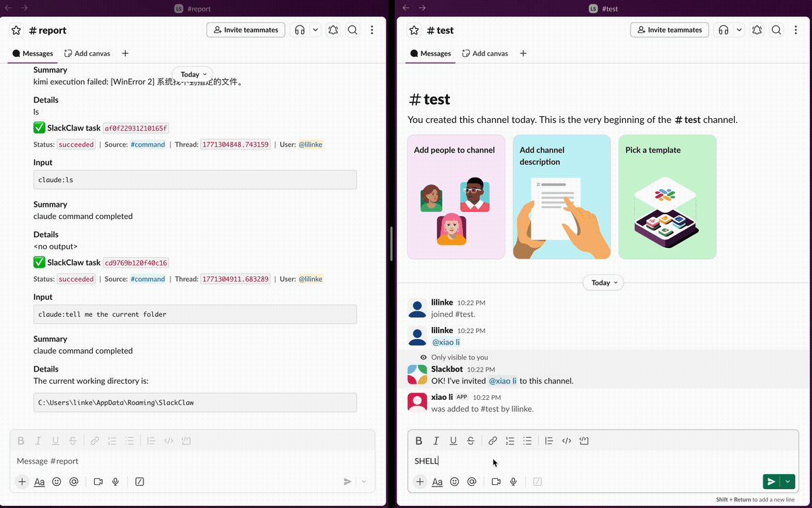
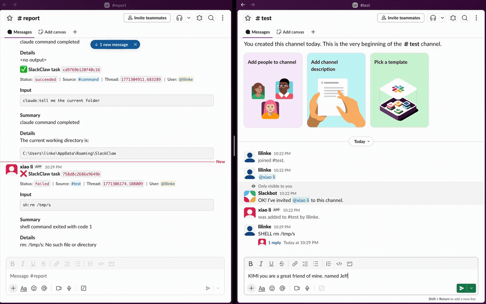

# SlackClaw

[](https://www.python.org/)
[](LICENSE)

[English](README.md) | [中文](README.zh-CN.md)

Type commands in Slack, run them locally, check reports in Slack.

SlackClaw is a local agent that watches a Slack channel for commands, executes them on your machine, and posts structured reports back to Slack. It supports shell commands and AI agent CLIs (Claude, Codex, Kimi) out of the box.

## Use Prebuilt Binary (Recommended)

Do not build from source for normal use. Use the packaged binary from GitHub Releases and run it directly.

- Download the latest binary for your OS from: `https://github.com/linkeLi0421/slackclaw/releases`
- Put it under `release/` (or any local path you prefer)
- Run setup once, then start the app

macOS:
```bash
chmod +x ./release/SlackClaw-macos-arm64
./release/SlackClaw-macos-arm64 --setup
./release/SlackClaw-macos-arm64
```

Linux:
```bash
chmod +x ./release/SlackClaw-linux-x64
./release/SlackClaw-linux-x64 --setup
./release/SlackClaw-linux-x64
```

Windows (PowerShell):
```powershell
.\release\SlackClaw-windows-x64.exe --setup
.\release\SlackClaw-windows-x64.exe
```

## How It Works

```
Slack command channel          Your machine             Slack report channel
┌─────────────────┐     ┌──────────────────────┐     ┌─────────────────────┐
│ SHELL ls -la    │ ──▶│ SlackClaw picks up   │ ──▶│ Formatted report    │
│ CLAUDE fix tests│     │ the message, runs it │     │ with status, output │
│ CODEX refactor  │     │ locally, then posts  │     │ and details         │
│ KIMI explain    │     │ the result to Slack  │     │                     │
│ MEMORY store .. │     │                      │     │                     │
└─────────────────┘     └──────────────────────┘     └─────────────────────┘
```

## Demo

### 1. Approval Mode for Dangerous Commands



Demonstrates the approval workflow for shell commands. When a potentially dangerous command (like `rm`) is detected, SlackClaw waits for emoji approval (:white_check_mark: or :x:) before execution. Safe commands run automatically based on the allowlist.

*Duration: 10 seconds | Shows: Command input, approval flow, success/failure reports*

---

### 2. Thread Context Sharing



Shows how AI agents (Claude, Codex, Kimi) maintain context within the same Slack thread. Replies in a thread share conversation history, allowing for follow-up questions and iterative workflows.

*Duration: 15 seconds | Shows: Thread replies, context retention, agent responses*

---

### 3. General Task Execution


A general-purpose task showing Kimi CLI integration. Ask questions, get summaries, or request code improvements — all from Slack and executed locally.

*Duration: 8 seconds | Shows: AI agent interaction, detailed responses, project assistance*

---

**Summary:** Type commands in Slack → Run locally → Get structured reports back in Slack.

1. You type a command in the Slack **command channel**
2. SlackClaw detects it, optionally waits for emoji approval
3. The command runs locally on your machine
4. A formatted report appears in the Slack **report channel**
5. A **local dashboard** shows live task status, queue, and config at `http://127.0.0.1:<port>`

## Quick Start

### 1. Create the Slack App

Go to [api.slack.com/apps](https://api.slack.com/apps) and create a new app:

- **Socket Mode** — enable it, then create an app-level token with `connections:write` scope
- **Event Subscriptions** — enable and subscribe to bot events: `message.channels`, `message.groups`, `reaction_added`
- **OAuth Bot Scopes** — add: `chat:write`, `channels:history`, `groups:history`, `files:read`, `files:write`
- **Install** the app to your workspace
- **Invite** the bot to your command and report channels: `/invite @your-bot`

See [slack-app-setup.md](slack-app-setup.md) for a detailed step-by-step walkthrough.

### 2. Run the Packaged App (No Source Build)

macOS:
```bash
./release/SlackClaw-macos-arm64 --setup
./release/SlackClaw-macos-arm64
```

Linux:
```bash
./release/SlackClaw-linux-x64 --setup
./release/SlackClaw-linux-x64
```

Windows (PowerShell):
```powershell
.\release\SlackClaw-windows-x64.exe --setup
.\release\SlackClaw-windows-x64.exe
```

On first run, SlackClaw opens a local setup page in your browser. Save Slack tokens/channel IDs there, then the app starts.

## Typing Commands in Slack

Send messages in your command channel. SlackClaw recognizes four command types:

| Prefix | What it does |
|--------|-------------|
| `SHELL` | Runs a shell command |
| `CLAUDE` | Sends a prompt to Claude Code CLI |
| `CODEX` | Sends a prompt to Codex CLI |
| `KIMI` | Sends a prompt to Kimi CLI |
| `FILE` | Uploads a local file to Slack |
| `MEMORY` | Store, recall, or manage persistent memories |

Examples you type in Slack:
```
SHELL echo hello
SHELL pytest tests/ -v
CLAUDE review this repo and list top 3 issues
CODEX fix failing tests and summarize changes
KIMI how can I improve this codebase
FILE /path/to/report.csv
MEMORY store project uses Python 3.11
MEMORY recall deployment process
```

You can also use the explicit prefix form:
```
!do sh:echo hello
!do file:/tmp/output.log
```

### File Attachments

Upload files (images, PDFs, CSVs, etc.) alongside your command in the same Slack message:
```
KIMI describe this screenshot
CLAUDE analyze this data
```

- Up to 4 files per message, 20 MB max each
- Any file type is supported (images, PDFs, text, archives, etc.)
- Files are downloaded locally and passed to the agent as file paths

### Auto-Filed Large Output

When command output exceeds `FILE_OUTPUT_THRESHOLD` (default 4000 chars), the full output is automatically uploaded as a `.txt` file instead of being truncated. A short preview is still shown inline.

### Approval Flow

With `APPROVAL_MODE=reaction` (default):
- Non-allowlisted shell commands pause and wait for emoji approval
- React with :white_check_mark: to approve, :x: to reject
- Allowlisted commands (echo, ls, git, python, etc.) run immediately
- AI agent commands (CLAUDE/CODEX/KIMI) follow `RUN_MODE` setting

### Thread Context

CLAUDE, CODEX, and KIMI commands are thread-aware:
- Replies in the same Slack thread share agent context
- Different threads run independently (parallel when `WORKER_PROCESSES>1`)

### Persistent Memory

When `MEMORY_ENABLED=true`, AI agents can recall facts, preferences, and procedures across conversations. Memory is stored as human-readable Markdown files and indexed with SQLite FTS5 for fast full-text search. See [Memory System Documentation](docs/memory-system.md) for full details on scopes, storage, prompt injection, auto-extraction, and agent integration.

**Manual commands:**
```
MEMORY store project uses Python 3.11        # store a user-scoped note
MEMORY store workspace:deploy uses Docker    # store a workspace-scoped note
MEMORY recall deployment process             # search memories by keyword
MEMORY forget a1b2c3d4e5f6g7h8              # delete a specific memory by ID
MEMORY list                                  # list your recent memories
```

**Automatic prompt injection:** When you run CLAUDE/CODEX/KIMI commands, relevant memories are automatically retrieved and injected into the prompt so agents have context from previous sessions.

**Auto-extraction:** When `MEMORY_AUTO_EXTRACT=true`, agents can tag facts in their output with `[MEMORY]: ...` or `[REMEMBER]: ...` and they are automatically saved for future recall.

**Storage layout:**
```
~/.config/SlackClaw/memory/
  user/<user_id>/       # per-user memories
  workspace/            # shared workspace memories
  thread/<channel>_<ts>/ # thread-scoped memories
```

Unaccessed memories are automatically purged after `MEMORY_RETENTION_DAYS` (default 90 days).

## Dashboard

SlackClaw starts a local web dashboard automatically on every run. The URL is printed at startup (e.g. `http://127.0.0.1:8391`). The dashboard auto-refreshes every 5 seconds and shows:

- **Stats** — total/pending/running/succeeded/failed task counts, queue size, in-flight count, memory count
- **Configuration** — current runtime settings (tokens are hidden)
- **Recent Tasks** — task history with status, command, user, timestamps
- **In-Flight / Queue** — tasks currently executing or waiting
- **Agent Sessions** — active thread-bound sessions for Claude/Codex/Kimi
- **Memories** — stored memory counts by scope (when memory is enabled)
- **Approvals** — pending and resolved approval requests
- **Execution Locks** — currently held lock keys

Set `DASHBOARD_PORT` to bind to a specific port (default: random available port, `0`).

## Configuration Reference

### Required

| Variable | Description |
|----------|-------------|
| `SLACK_BOT_TOKEN` | Bot user OAuth token (`xoxb-...`) |
| `SLACK_APP_TOKEN` | App-level token (`xapp-...`, for socket mode) |
| `COMMAND_CHANNEL_ID` | Slack channel ID where commands are posted |
| `REPORT_CHANNEL_ID` | Slack channel ID where reports appear |

### Execution

| Variable | Default | Description |
|----------|---------|-------------|
| `DRY_RUN` | `true` | Show plan without executing. Set `false` to run commands |
| `EXEC_TIMEOUT_SECONDS` | `120` | Max seconds per command |
| `WORKER_PROCESSES` | `1` | Number of parallel workers |
| `RUN_MODE` | `approve` | `approve` = wait for approval; `run` = execute immediately |
| `DASHBOARD_PORT` | `0` | Port for the local dashboard (`0` = random available port) |

### Listener & Trigger

| Variable | Default | Description |
|----------|---------|-------------|
| `LISTENER_MODE` | `socket` | `socket` or `poll` |
| `TRIGGER_MODE` | `prefix` | `prefix` or `mention` |
| `TRIGGER_PREFIX` | `!do` | Message prefix that triggers SlackClaw |
| `BOT_USER_ID` | — | Required when `TRIGGER_MODE=mention` |
| `POLL_INTERVAL` | `3` | Seconds between polls (poll mode only) |

### Approval

| Variable | Default | Description |
|----------|---------|-------------|
| `APPROVAL_MODE` | `reaction` | `reaction` or `none` |
| `APPROVE_REACTION` | `white_check_mark` | Emoji to approve |
| `REJECT_REACTION` | `x` | Emoji to reject |
| `SHELL_ALLOWLIST` | *(common utilities)* | Commands that skip approval |

### Agent Settings

| Variable | Default | Description |
|----------|---------|-------------|
| `AGENT_WORKDIR` | — | Working directory for all agents |
| `KIMI_PERMISSION_MODE` | `yolo` | `yolo`, `auto`, `yes`, or `default` |
| `CODEX_PERMISSION_MODE` | `full-auto` | `full-auto`, `dangerous`, or `default` |
| `CODEX_SANDBOX_MODE` | `workspace-write` | `workspace-write`, `read-only`, or `danger-full-access` |
| `CLAUDE_PERMISSION_MODE` | `acceptEdits` | Any Claude `--permission-mode` value |
| `AGENT_RESPONSE_INSTRUCTION` | *(markdown prompt)* | Prompt style hint for agent output; empty to disable |

### Memory

| Variable | Default | Description |
|----------|---------|-------------|
| `MEMORY_ENABLED` | `false` | Enable the persistent memory system |
| `MEMORY_MAX_PER_SCOPE` | `100` | Max memories per scope key |
| `MEMORY_RETENTION_DAYS` | `90` | Auto-purge unaccessed memories after this many days |
| `MEMORY_INJECTION_MAX_CHARS` | `2000` | Max chars of memory context injected into prompts |
| `MEMORY_AUTO_EXTRACT` | `false` | Auto-extract `[MEMORY]:` tags from agent output |
| `MEMORY_DIR` | *(platform config dir)* | Custom path for memory `.md` files |

### Report Limits

| Variable | Default | Description |
|----------|---------|-------------|
| `REPORT_INPUT_MAX_CHARS` | `500` | Max chars for input section |
| `REPORT_SUMMARY_MAX_CHARS` | `1200` | Max chars for summary section |
| `REPORT_DETAILS_MAX_CHARS` | `4000` | Max chars for details section |
| `FILE_OUTPUT_THRESHOLD` | `4000` | Auto-upload output as file when exceeding this char count |

## Packaging

Build a standalone binary on your target OS:

macOS / Linux:
```bash
./scripts/build_app.sh
```

Windows (PowerShell):
```powershell
.\scripts\build_app.ps1
```

Notes:
- PyInstaller is not reliable for cross-compiling Windows binaries from macOS/Linux (or vice versa).
- Build on each target OS, or use GitHub Actions release builds (tag `v*`) to produce macOS/Linux/Windows binaries.
- Output naming:
  - macOS/Linux script: `release/SlackClaw-<os>-<arch>`
  - Windows script: `release/SlackClaw-windows-<arch>.exe`

The packaged binary opens a setup UI in your browser on first run — no `.env` file needed. Config is saved to:
- macOS: `~/Library/Application Support/SlackClaw/config.json`
- Linux: `~/.config/SlackClaw/config.json`
- Windows: `%APPDATA%\SlackClaw\config.json`

Binary flags:
- `--setup` — reopen the setup UI
- `--show-config-path` — print config path and exit

## Developer Mode (Source)

Use this only for local development/debugging. End users should run the packaged binary.

```bash
cp .env.example .env
set -a; source .env; set +a; ./scripts/run_agent.sh
```

Single cycle:
```bash
./scripts/run_agent.sh --once
```

## Guardrails

SlackClaw executes commands on your local machine. Keep these protections enabled:

- Start with `DRY_RUN=true` to verify command flow before real execution
- Keep `APPROVAL_MODE=reaction` to review commands before they run
- Set reasonable `EXEC_TIMEOUT_SECONDS` to prevent runaway processes
- Never run privileged or destructive commands (`sudo`, `rm -rf /`, etc.) from Slack
- Monitor the report channel for failures or unexpected output

## Test

```bash
PYTHONPATH=src python3 -m unittest discover -s tests -v
```

## Requirements

- Python 3.11+
- `pip install -r requirements.txt`

## License

MIT. See `LICENSE`.

## Roadmap

Improvement ideas inspired by [OpenClaw](https://openclaw.ai/) and the [awesome-openclaw-usecases](https://github.com/hesamsheikh/awesome-openclaw-usecases) collection.

### High Priority

- [x] **File Upload for Long Output** — When output exceeds `FILE_OUTPUT_THRESHOLD`, automatically upload as a `.txt` file. Also supports `FILE <path>` command to upload local files directly.
- [ ] **Custom Skills / Aliases** — Let users define reusable named commands (e.g., `!do deploy-staging`) that map to multi-step scripts. Store in a `skills/` directory or config.
- [ ] **Scheduled / Cron Tasks** — Support recurring commands (e.g., `!do every 6h: git pull && pytest`). Store schedules in SQLite, run a scheduler thread alongside the listener.
- [ ] **Webhook Triggers** — Add a lightweight HTTP server that accepts POST requests to trigger tasks. Enables GitHub webhooks, CI/CD callbacks, and monitoring alerts.

### Medium Priority

- [x] **Persistent Agent Memory** — Give AI agents a shared memory store beyond thread context so they can remember user preferences, project facts, and past decisions across threads. Markdown files + SQLite FTS5 for human-readable storage with fast BM25-ranked retrieval.
- [ ] **Proactive Notifications** — Monitor files, directories, or URLs and post alerts to Slack when changes are detected (file watcher + URL polling).
- [ ] **Multi-Platform Support** — Abstract listener/reporter into a platform interface so Discord, Telegram, or Microsoft Teams can be added as alternative frontends.
- [ ] **Browser Automation** — Integrate Playwright via a new command type (`BROWSE <url> <instruction>`) to scrape pages, fill forms, or capture screenshots.

### Nice to Have

- [ ] **RAG / Knowledge Base** — Vector search over local documents so agents can reference project docs, wikis, and past reports.
- [ ] **Skill Auto-Creation** — Let AI agents autonomously define new skills from conversation (e.g., "remember this as `deploy-staging`").
- [ ] **Multi-Agent Coordination** — Allow multiple agents to collaborate on a single task using parallel worktrees.
- [ ] **Rich Report Formatting** — Support charts, tables, and inline images in Slack reports.

## Thanks

- https://github.com/korotovsky/slack-mcp-server
